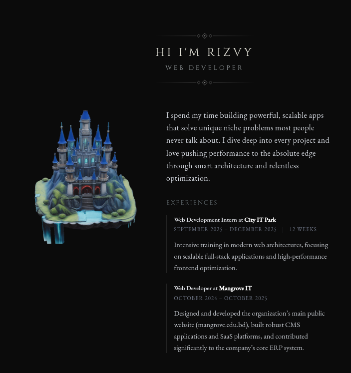

# 🏰 Rizvy's Dark Fantasy Portfolio

> A high-performance developer portfolio built with a dark fantasy aesthetic — cinematic, immersive, and unapologetically bold.



---

## ✨ Overview

This is my personal developer portfolio, designed to stand out from the crowd. Instead of the usual minimal white-card layout, this portfolio leans into a **dark fantasy world** — complete with a 3D animated castle, custom sword scrollbar, cinematic loading sequences, and a GitHub contribution chronicle styled like ancient lore.

Built to showcase not just projects, but personality.

---

## 🛠 Tech Stack

| Layer | Tech |
|---|---|
| **Framework** | Next.js 16 (App Router) |
| **Language** | TypeScript |
| **Styling** | Tailwind CSS v4 |
| **3D Rendering** | React Three Fiber + Drei + `@google/model-viewer` |
| **Animations** | Custom CSS keyframes + JS-driven effects |
| **Data** | GitHub Contributions API via `react-github-calendar` |

---

## 🚀 Running Locally

```bash
# Install dependencies
npm install

# Start dev server
npm run dev
```

Open [http://localhost:3000](http://localhost:3000) in your browser.

---

## 🌐 Deployment

This site is configured for deployment on **Netlify** via GitHub. Every push to `master` triggers an automatic build and deploy.

```
Build command: next build
Publish directory: .next
```

---

## 📁 Project Structure

```
devfolio/
├── app/              # Next.js App Router pages & layout
├── components/       # Reusable UI components
│   ├── CastleModel.tsx       # 3D castle via model-viewer
│   ├── GithubActivity.tsx    # GitHub chronicle tracker
│   ├── SwordScrollbar.tsx    # Custom animated scrollbar
│   ├── VideoLoader.tsx       # Cinematic intro loader
│   └── ...
├── public/           # Static assets (3D models, images)
└── next.config.ts    # Next.js configuration
```

---

## 📬 Contact

- **GitHub**: [@devrizvy](https://github.com/devrizvy)

---

*Built with obsession, not templates.*
